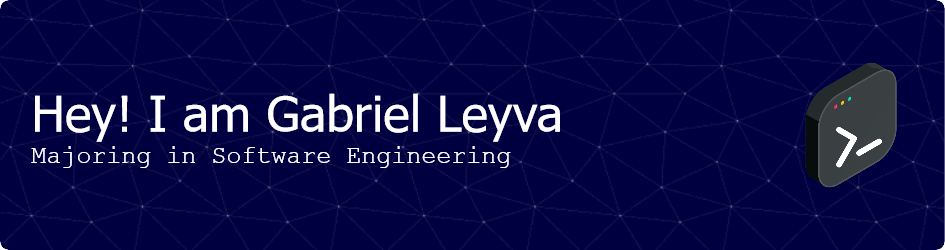

## About Me

 📍 <strong>Son, Mexico </strong>🇲🇽🌮

  📚 <strong>Passionate Software Engineering Student and Backend Enthusiast</strong> 
  Hello there! I am a dedicated software engineering student with a strong passion for backend development. Outside of my academic pursuits, I spend my free time coding and exploring the intricacies of software architecture.

  🛠️ <strong>Founder of Geverel Software: Crafting Web and Custom App Solutions</strong> 
  Currently, I am the proud founder of Geverel Software, an agency specializing in web development and application development.
  <a href="https://www.geverel.com" target="_blank">Geverel Software</a>

  👨‍💻 <strong>Love for Coding Beyond the Classroom</strong> 
  Coding is not just a profession for me; it's a hobby and a continuous learning journey. I thrive on challenges and am always eager to explore new technologies and industry trends.

## Visitor Count

## 🌌Technologies Stack
<h3>➡️Languages</h3>

 
    
    
    
    
    

<h3>➡️Backend Development + Database + Technologies & Tools</h3>

    
    
    
    
    
    

 ## 📘Connect with Me

    
    
    

<!--
**leyv4a/leyv4a** is a ✨ _special_ ✨ repository because its `README.md` (this file) appears on your GitHub profile.

Here are some ideas to get you started:

- 🔭 I’m currently working on ...
- 🌱 I’m currently learning ...
- 👯 I’m looking to collaborate on ...
- 🤔 I’m looking for help with ...
- 💬 Ask me about ...
- 📫 How to reach me: ...
- 😄 Pronouns: ...
- ⚡ Fun fact: ...
-->
